# 🌿 LeafyLife – Plant Care & Community App

LeafyLife is a beautiful plant care and community application developed using Flutter as a learning project.
This app helps plant enthusiasts discover, learn about, and care for their green companions.

> ⚠️ This is not a production-ready app. It was created for learning and academic purposes.

---

## 📱 Features

### 👤 User Management
- Splash screen with auto-navigation
- Welcome screen with onboarding (3 pages)
- User login and registration
- Session management

### 🌱 Plant Discovery (All Users)
- Browse 30+ plants in beautiful grid layout
- Search plants by name
- Filter plants by category (Indoor, Outdoor, Succulents, Flowering)
- View detailed plant information
- Save favorite plants with heart icon

### 📚 Plant Information
- Plant name, type, and price
- Watering schedule (every 2-3 days, weekly, etc.)
- Sunlight requirements (indirect, direct, full sun)
- Temperature preferences
- Difficulty level (Very Easy, Easy, Moderate)
- Custom care tips for each plant
- Detailed plant description

### 🏠 My Garden (User)
- Add plants to personal garden
- Track when plants were added
- View watering reminders
- Remove plants from garden
- Prevent duplicate entries

### ❤️ Favorites System
- Save favorite plants to wishlist
- View all favorites in dedicated page
- Remove from favorites with one tap
- Persistent favorites during app session

### 👤 User Profile
- Profile image and personal information
- Stats (Plants owned, Favorites, etc.)
- Edit profile functionality
- Menu options: My Garden, My Favorites, Plant Care Tips, Settings, About LeafyLife, Logout

### ⚙️ Settings
- Dark mode toggle (coming soon)
- Push notifications toggle
- Sound effects toggle
- Watering reminders toggle
- Fertilizer reminders toggle
- Clear cache option
- Privacy policy and terms links

### 📖 Plant Care Tips Library
- Watering tips (5+ tips)
- Sunlight guide (5+ tips)
- Soil & fertilizer guide
- Temperature & humidity tips
- Common problems & solutions
- Beginner-friendly plants list
- Essential gardening tools

### 📄 About Page
- App logo and version
- Our Mission statement
- Our Vision statement
- Key features list
- Developer information
- Contact details

### 🗂️ Data Handling
- Static data for plants (30+ plants)
- Persistent favorites using Map
- Persistent garden using Singleton pattern
- No external database required

### 🎨 User Interface
- Material Design UI
- Green color theme (#4CAF50)
- Grid and list layouts
- Card-based design
- Responsive for different screen sizes
- Smooth animations and transitions

---

## 🏗️ Application Structure

### Screens / Pages (13 Total)

| Page | File Name | Purpose |
|------|-----------|---------|
| Splash Screen | splash_screen.dart | App loading with auto-navigation |
| Onboarding 1 | onboarding_page1.dart | "Discover Your Type of Plant" |
| Onboarding 2 | onboarding_page2.dart | "Connect With Other Plant Lovers" |
| Onboarding 3 | onboarding_page3.dart | "Welcome Back!" introduction |
| Login Page | login_page.dart | User authentication |
| Home Page | home_page.dart | Main dashboard with plant grid |
| Plant Details | plant_details_page.dart | Individual plant information |
| My Garden | my_garden_page.dart | User's plant collection |
| Favorites | favorites_page.dart | Saved favorite plants |
| Profile | profile_page.dart | User profile and menu |
| Settings | settings_page.dart | App preferences |
| About | about_page.dart | App information |
| Care Tips | care_tips_page.dart | Plant care guide library |

### Core Components
- **State Management**: setState() with StatefulWidget
- **Data Persistence**: Map for favorites, Singleton for garden
- **Navigation**: Navigator.push() and Navigator.pop()
- **Layouts**: Row, Column, Stack, GridView, ListView

---

## 🛠️ Technologies Used

| Technology | Purpose |
|------------|---------|
| Flutter | Cross-platform framework |
| Dart | Programming language |
| Material Design | UI components and styling |
| setState() | State management |
| Local Assets | Images storage |

---

## 📁 Project Structure

```text
lib/
│
├── main.dart                 # App entry point
├── splash_screen.dart        # Loading screen
├── onboarding_page1.dart     # First onboarding
├── onboarding_page2.dart     # Second onboarding
├── onboarding_page3.dart     # Third onboarding
├── login_page.dart           # Login screen
├── home_page.dart            # Main dashboard
├── plant_details_page.dart   # Plant details view
├── my_garden_page.dart       # My garden collection
├── favorites_page.dart       # Saved favorites
├── profile_page.dart         # User profile
├── settings_page.dart        # App settings
├── about_page.dart           # App information
├── care_tips_page.dart       # Plant care guide
└── garden_data.dart          # Garden data singleton

assets/
│
├── monstera.png
├── snakeplant.png
├── peacelily.png
├── fern.png
├── orchid.png
├── cactus.png
├── aloevera.png
├── rose2.png
├── sunflower.png
├── lavender.png
├── profile.png
└── ... (30+ plant images)

---
``` 

## 🎯 What I Learned

Through this project, I gained hands-on experience working with:

- **Flutter Framework** – Building cross-platform mobile apps
- **Stateful & Stateless Widgets** – Managing app state
- **Navigation & Routing** – Moving between screens with data passing
- **Layout Design** – Using Row, Column, Stack, GridView, ListView
- **Form Handling** – TextField, TextEditingController, validation
- **User Interaction** – Buttons, icons, gesture detection
- **Asset Management** – Adding and displaying local images
- **Data Persistence** – Using Map and Singleton patterns
- **Responsive UI** – Creating layouts for different screen sizes
- **UI/UX Design** – Creating beautiful, user-friendly interfaces
- **Problem Solving** – Debugging and fixing common Flutter issues

---

## 📸 Screenshots

| Splash Screen | Onboarding 1 | Onboarding 2 | Onboarding 3 |
|---------------|--------------|--------------|--------------|
| 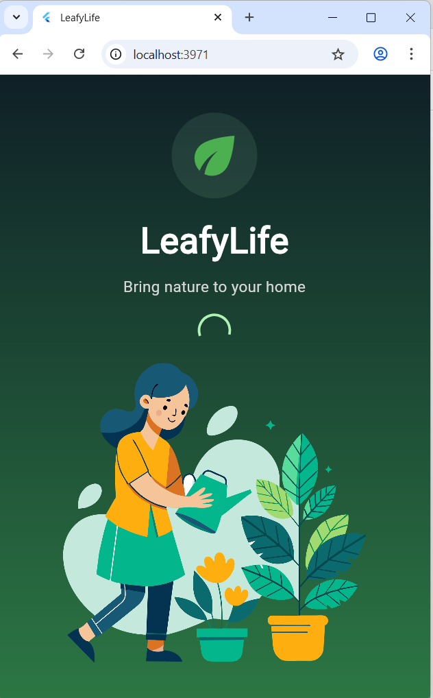 | 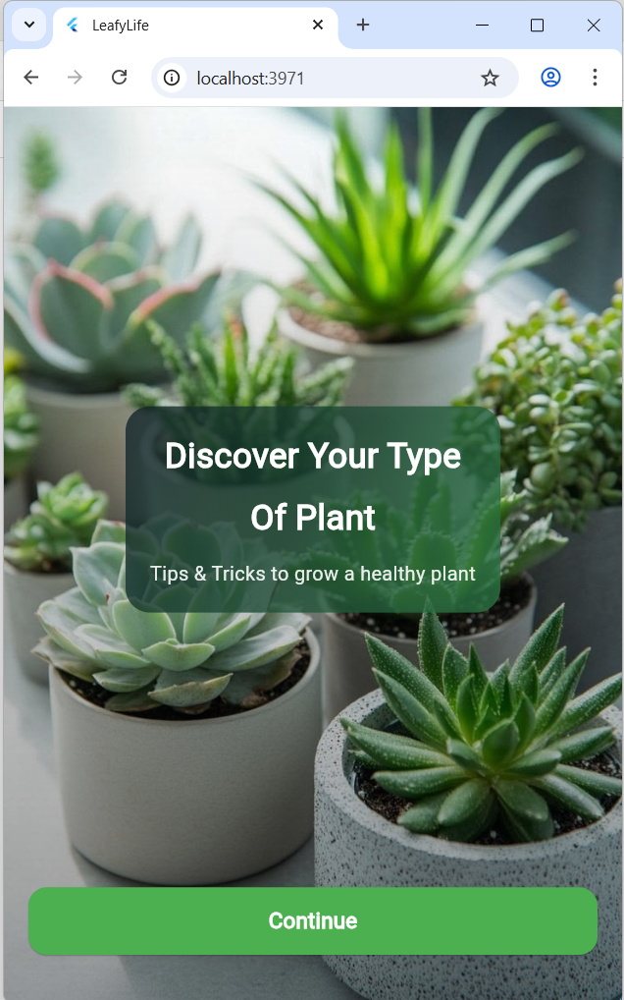 | 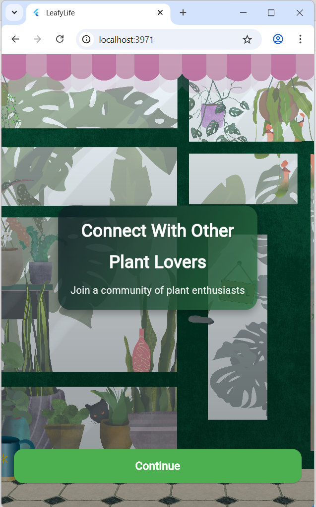 | 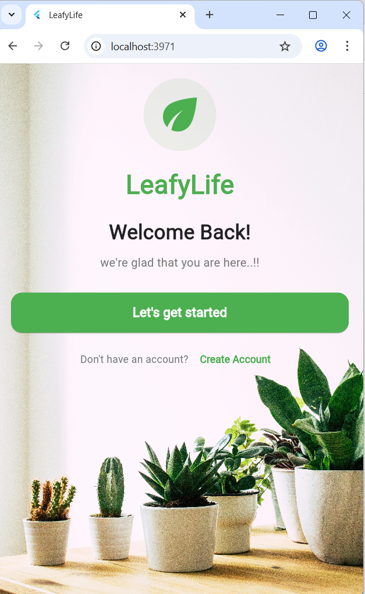 |

| Login | Home Page | Plant Details | My Garden |
|-------|-----------|---------------|-----------|
| 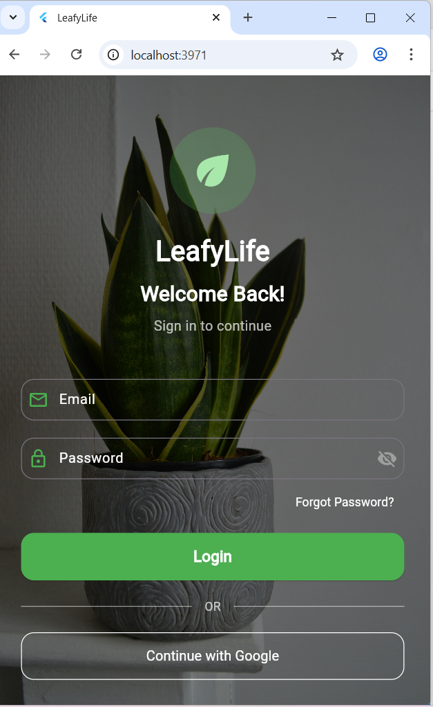 | 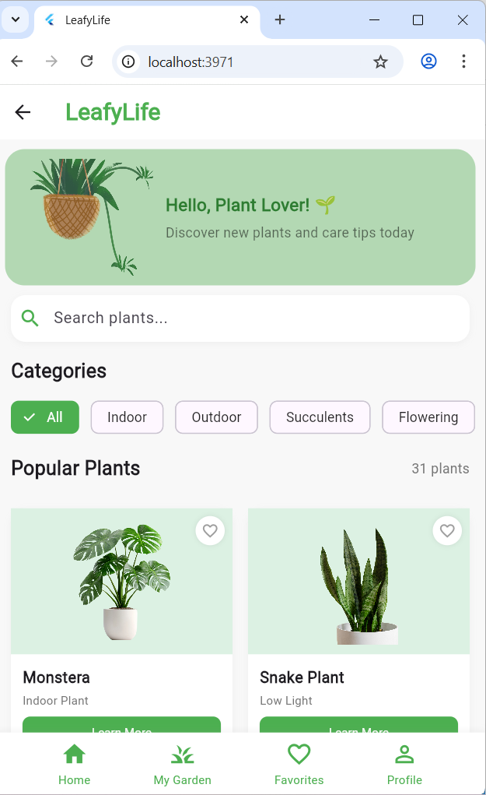 | 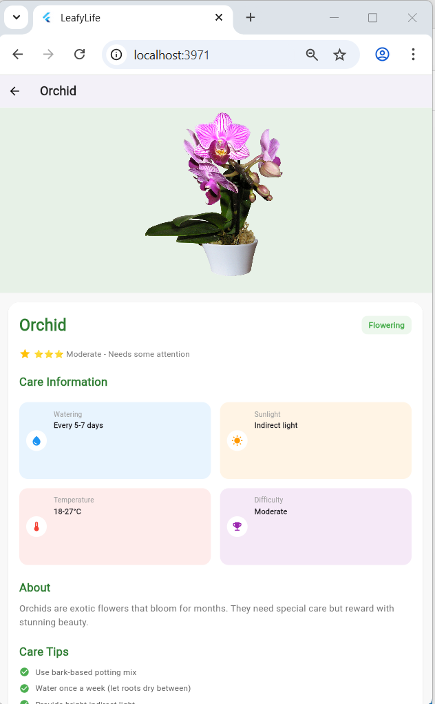 | 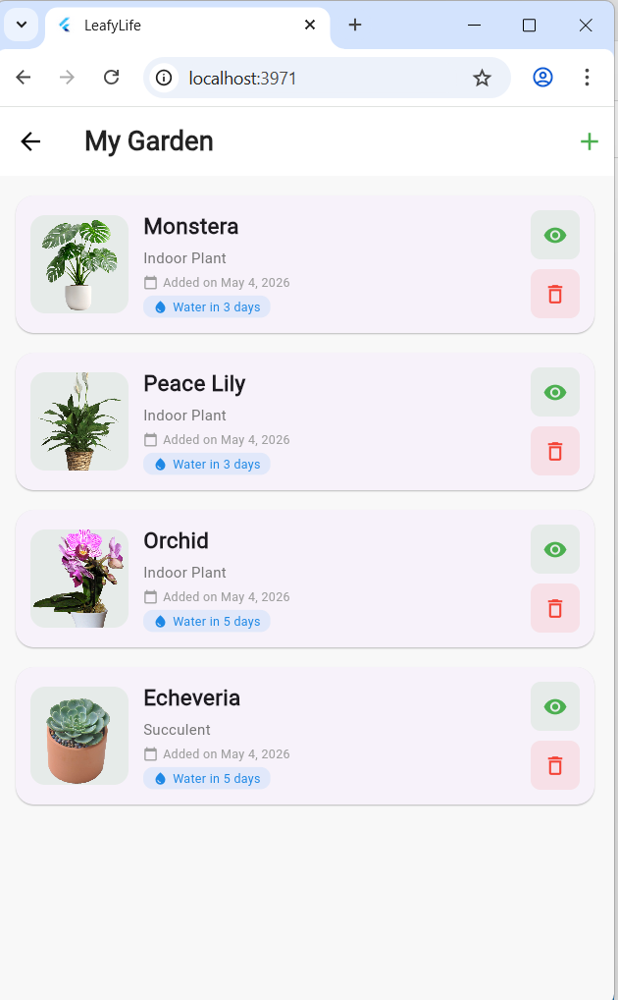 |

| Favorites | Profile | Settings | Care Tips |
|-----------|---------|----------|-----------|
| 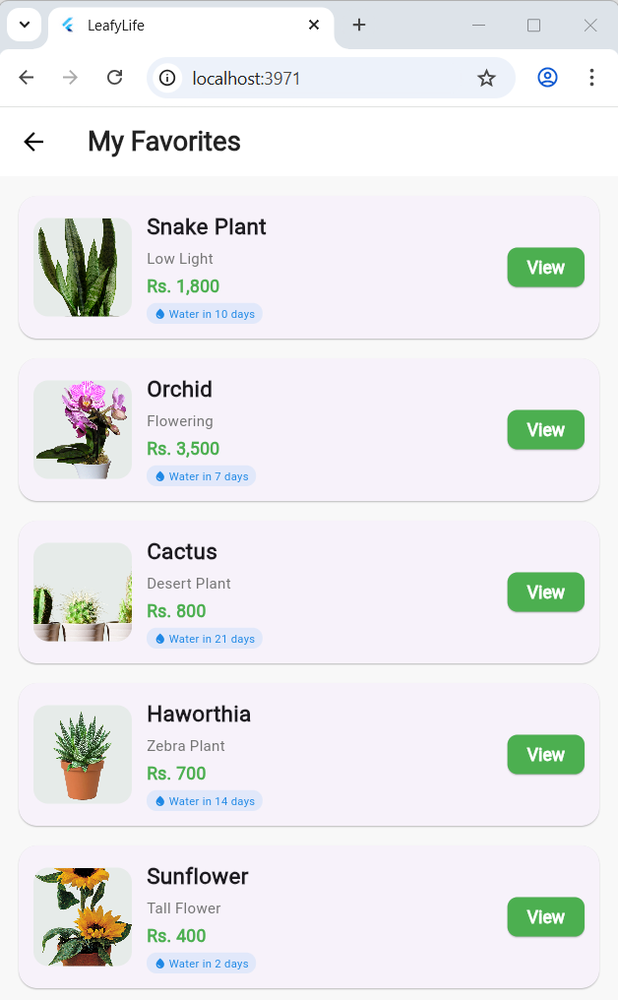 | 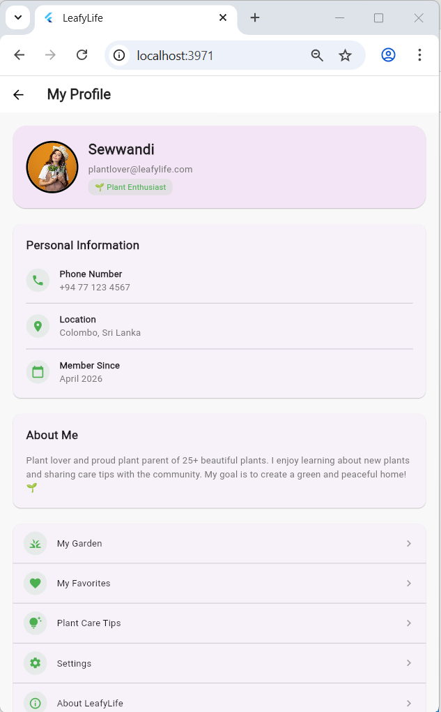 | 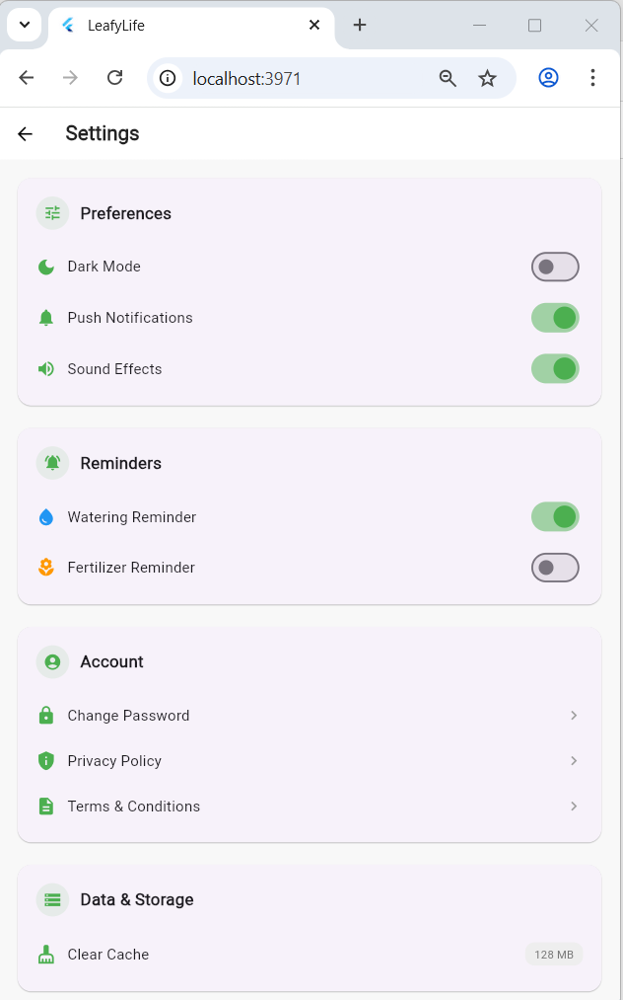 | 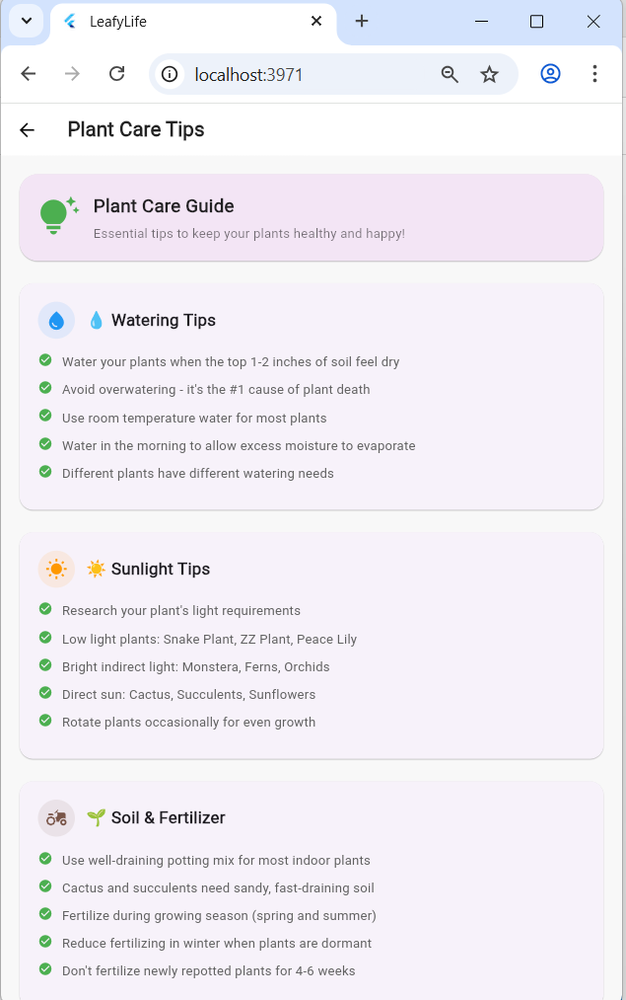 |

---

## 🚀 How to Run the Project

### Prerequisites
- Flutter SDK (latest version)
- Android Studio / VS Code
- Android Emulator / Chrome browser

### Installation


# Clone the repository
git clone https://github.com/pabodha032/leafylife_plant_care_app.git

# Navigate to project
cd leafylife_plant_care_app

# Get dependencies
flutter pub get

# Run the app
flutter run -d chrome      # For web
flutter run -d android     # For Android device/emulator

## 📌 Notes
- This project is developed for learning purposes  
- All plant data is static (no backend required)  
- Images are stored locally in the assets folder  
- Favorites and garden data persist during the app session  
- No internet connection required  
- Improvements and new features can be added in the future  
- Code is written to be simple and easy to understand  

## 🔧 Future Improvements
- Firebase authentication (Google Sign-In)  
- Real-time database for dynamic plant listings  
- Image upload for user profile and plants  
- Push notifications for watering reminders  
- Plant identification using camera  
- Social features (share plant photos, comments)  
- Dark mode implementation  
- Multiple language support  
- Plant buying/selling marketplace (optional)  

## 🙌 Acknowledgments
- Flutter Team – For the amazing framework  
- Material Design – For design guidelines  
- Unsplash – For plant images  
- Instructors – For guidance and support  

## ⭐ Feel free to explore, fork, or suggest improvements!

## Made with ❤️ for plant lovers everywhere 🌿💚

